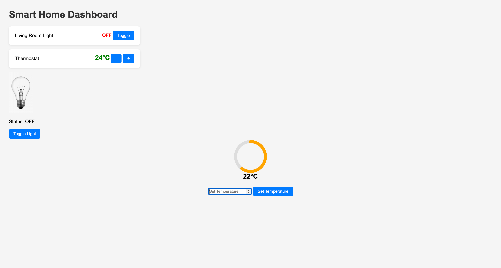

# 🏠 Smart Home Dashboard

A **real-time IoT-based dashboard** to control and monitor smart devices like lights and thermostat, built with **Node.js, Express, Socket.io, MongoDB, and MQTT**.  
It works with both **virtual devices** and real **MQTT-enabled IoT devices**.

---

## 🚀 Features

- **Real-time Device Control** – Light toggle + temperature control via dashboard.
- **Live Status Updates** – Uses Socket.io for instant UI updates.
- **Animated UI** – Bulb icon changes and temperature gauge animation.
- **Manual Temperature Set** – Enter a custom temperature value.
- **Persistent Data** – MongoDB stores the latest device states.

---

## 📸 UI Preview

## 📸 UI Preview



---

## 🛠️ Tech Stack

**Frontend**

- HTML, CSS, JavaScript
- SVG-based temperature gauge
- Socket.io client

**Backend**

- Node.js, Express.js
- MongoDB with Mongoose
- MQTT (HiveMQ public broker)
- Socket.io server

---

## 📂 Folder Structure

smart-home-dashboard/
├── index.html # Main dashboard page
├── style.css # Styling
├── script.js # Frontend logic
├── server.js # Backend server (Express + MQTT + Socket.io)
├── package.json # Dependencies
└── README.md # Documentation

---

## ⚙️ Setup Instructions

### 1️⃣ Clone the repository

```bash
git clone https://github.com/<your-username>/smart-home-dashboard.git
cd smart-home-dashboard

2️⃣ Install dependencies
bash
Copy
Edit
npm install
3️⃣ Start MongoDB (Mac example)
bash
Copy
Edit
brew services start mongodb-community@7.0
4️⃣ Start the server
bash
Copy
Edit
node server.js
5️⃣ Open in browser
arduino
Copy
Edit
http://localhost:3000
📡 MQTT Topics
Device	Topic	Message
Light	home/livingroom/light	1 / 0
Temperature	home/livingroom/temperature	Number °C

🔮 Future Improvements
Add more device controls (fan, AC, door lock)

Temperature history graph using Chart.js

User authentication

Mobile-friendly responsive design

👨‍💻 Author
Sameer Saifi
```
